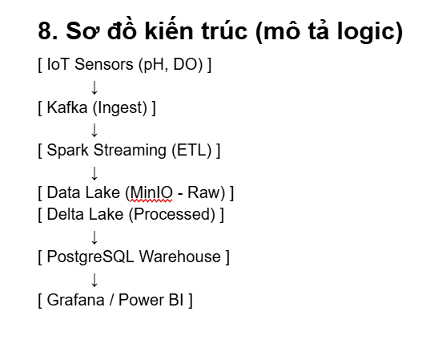

# Hệ thống phân tích và giám sát chất lượng sông

## Mục tiên
* Giám sát, xử lý và phân tích dữ liệu cảm biến nước sông theo thời gian thực.
* Phát hiện bất thường, cảnh báo và hiển thị dashboard

## Thành viên

- Nguyễn Thái Hiếu: 20225127 [@Hiesu19](https://www.github.com/Hiesu19)
- Phí Hoàng Việt: 20225429 [@Je-Tiev](https://github.com/Je-Tiev)
- Vũ Mạnh Hưng: 20225198 [@vmh714](https://github.com/vmh714)
- Hà Huy Dương: 20225183 [@brown2004](https://github.com/brown2004)
- Nguyễn Đức Dương: 20225122 [@duongdeptrai](https://github.com/duongdeptrai)

## Kiến trúc tổng thể

